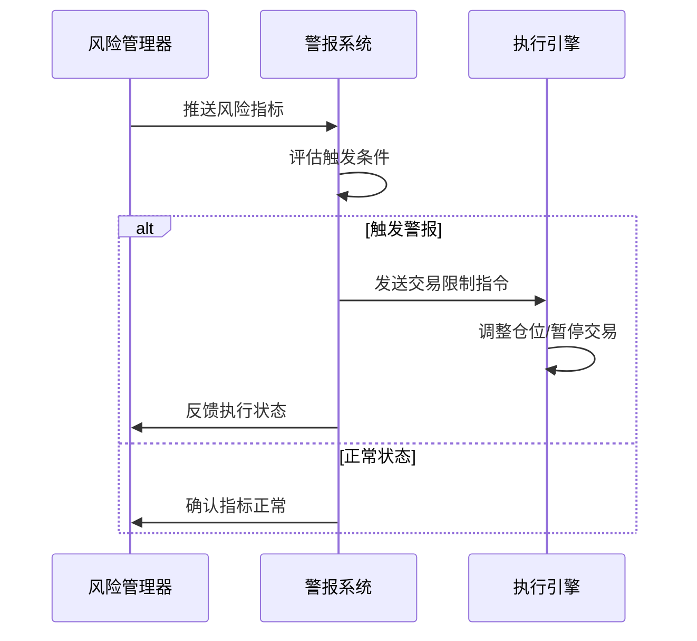

# 预警与熔断系统设计

## 1. 多级警报机制

```python
from enum import Enum

class AlertLevel(Enum):
    WATCH = 1       # 监控状态（黄色警报）
    CAUTION = 2     # 减少风险暴露（橙色警报）
    STOP = 3        # 停止交易（红色警报）
    LOCKDOWN = 4    # 强制平仓（黑色警报）

class AlertType(Enum):
    RISK = 1        # 风险指标触发
    LIQUIDITY = 2   # 流动性触发
    TECH = 3        # 技术指标触发
    EXTERNAL = 4    # 外部事件触发
```

## 2. 熔断触发条件

### 2.1 风险指标触发
```python
RISK_TRIGGERS = {
    AlertLevel.WATCH: {
        "var_breach": 0.8,     # VaR达到限额的80%
        "drawdown": 0.05       # 回撤超过5%
    },
    AlertLevel.CAUTION: {
        "var_breach": 0.9,
        "drawdown": 0.07
    },
    AlertLevel.STOP: {
        "var_breach": 1.0,
        "drawdown": 0.10
    }
}
```

### 2.2 流动性触发
```python
LIQUIDITY_TRIGGERS = {
    AlertLevel.WATCH: {
        "volume_ratio": 0.5,   # 交易量低于平均的50%
        "spread_increase": 2.0 # 买卖价差扩大2倍
    },
    AlertLevel.STOP: {
        "volume_ratio": 0.2,
        "spread_increase": 5.0
    }
}
```

## 3. 系统架构



## 4. 核心组件

### 4.1 条件评估引擎
```python
class ConditionEvaluator:
    def __init__(self, config):
        self.thresholds = config
        
    def evaluate(self, metrics):
        alerts = []
        for level in AlertLevel:
            for metric, threshold in self.thresholds.get(level, {}).items():
                if metrics[metric] >= threshold:
                    alerts.append({
                        "level": level,
                        "metric": metric,
                        "value": metrics[metric]
                    })
        return alerts
```

### 4.2 熔断执行器
```python
class CircuitBreaker:
    def __init__(self, trading_system):
        self.trading_system = trading_system
        
    def execute_breaker(self, alert_level):
        actions = {
            AlertLevel.WATCH: self._watch_actions,
            AlertLevel.CAUTION: self._caution_actions,
            AlertLevel.STOP: self._stop_actions,
            AlertLevel.LOCKDOWN: self._lockdown_actions
        }
        return actions[alert_level]()
    
    def _watch_actions(self):
        """监控阶段操作"""
        return {"action": "log_alert", "message": "进入监控状态"}
        
    def _caution_actions(self):
        """谨慎操作"""
        self.trading_system.reduce_leverage(50)
        return {"action": "reduce_exposure", "amount": 50}
    
    def _stop_actions(self):
        """停止交易"""
        self.trading_system.cancel_all_orders()
        return {"action": "stop_trading"}
    
    def _lockdown_actions(self):
        """强制平仓"""
        self.trading_system.liquidate_positions()
        return {"action": "liquidate_all"}
```

## 5. 恢复机制

```python
class RecoveryManager:
    def __init__(self):
        self.breach_history = []
        
    def check_recovery(self, metrics):
        """检查是否满足恢复条件"""
        recovery_conditions = {
            "var_ratio": 0.7,
            "liquidity_score": 0.8,
            "volatility": 0.15
        }
        return all(metrics[k] <= v for k,v in recovery_conditions.items())
    
    def gradual_recovery(self):
        """分阶段恢复交易"""
        steps = [
            {"action": "resume_limit_orders"},
            {"action": "resume_small_orders"},
            {"action": "full_resume"}
        ]
        return steps
```

## 6. 监控仪表板

```python
class AlertDashboard:
    def __init__(self):
        self.active_alerts = []
        
    def update_display(self, new_alerts):
        """更新警报显示"""
        self.active_alerts = sorted(
            new_alerts,
            key=lambda x: x['level'],
            reverse=True
        )
        
    def generate_report(self):
        """生成警报报告"""
        return {
            "timestamp": datetime.now(),
            "active_alerts": self.active_alerts,
            "historical_stats": self._calculate_stats()
        }
```

## 7. 配置管理

```yaml
# alerts_config.yaml
risk_levels:
  WATCH:
    var_breach: 0.8
    drawdown: 0.05
  CAUTION:
    var_breach: 0.9
    drawdown: 0.07
  STOP:
    var_breach: 1.0
    drawdown: 0.10

recovery:
  check_interval: 300  # 5分钟检查一次恢复条件
  max_lockdown: 86400   # 最大封锁时间24小时
```

## 8. 实施路线图

### 阶段1：基础警报系统（1个月）
- 实现核心评估引擎
- 基本熔断动作
- 简单仪表板

### 阶段2：高级功能（2个月）
- 多因子复合警报
- 机器学习异常检测
- 自动恢复机制

### 阶段3：优化集成（1个月）
- 性能优化
- 多语言支持
- 审计日志

## 9. 测试策略

1. **单元测试**：验证单个警报触发条件
2. **集成测试**：全流程警报触发与执行
3. **压力测试**：模拟极端市场条件下的表现
4. **恢复测试**：验证系统恢复能力

## 10. 监控指标

| 指标名称          | 描述                     | 监控频率 |
|-------------------|--------------------------|----------|
| 警报触发率        | 单位时间触发警报次数     | 实时     |
| 熔断执行延迟      | 从触发到执行的时间差     | 每分钟   |
| 误报率            | 错误触发警报的比例       | 每日     |
| 恢复成功率        | 成功恢复交易的比例       | 每小时   |

这个设计文档完整描述了预警与熔断系统的架构和实现细节。