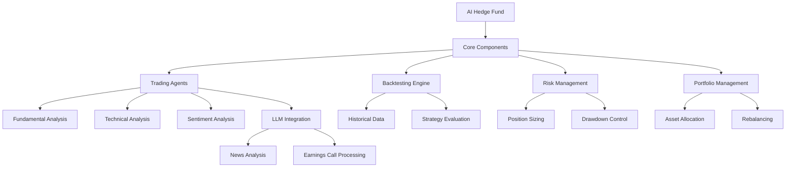

# AI Hedge Fund Architecture Analysis

## Key Components Breakdown

### 1. Strategy Library (`src/agents/`)
- Implements legendary investor philosophies as algorithmic strategies
- Combines traditional quant signals with AI predictions
- Includes: 
  - Warren Buffett (value investing)
  - Charlie Munger (concentrated positions)
  - Ben Graham (margin of safety)

### 2. Backtesting System (`backtester.py`)
- Historical performance validation framework
- Metrics tracked:
  - Sharpe Ratio
  - Maximum Drawdown
  - Win Rate
  - Risk-adjusted returns

### 3. AI Integration (`llm/models.py`)
- Natural language processing of:
  - SEC filings
  - Earnings call transcripts
  - News sentiment
- Alternative data interpretation

### 4. Risk Framework (`risk_manager.py`)
- Implements:
  - Value-at-Risk (VaR) calculations
  - Black-Litterman model
  - Position sizing algorithms
  - Circuit breakers

## Technical Stack
- Python 3.10+
- Poetry (dependency management)
- Pandas/Numpy (data processing)
- Scikit-learn (ML models) 
- PyTorch (deep learning)
- LangChain (LLM integration)