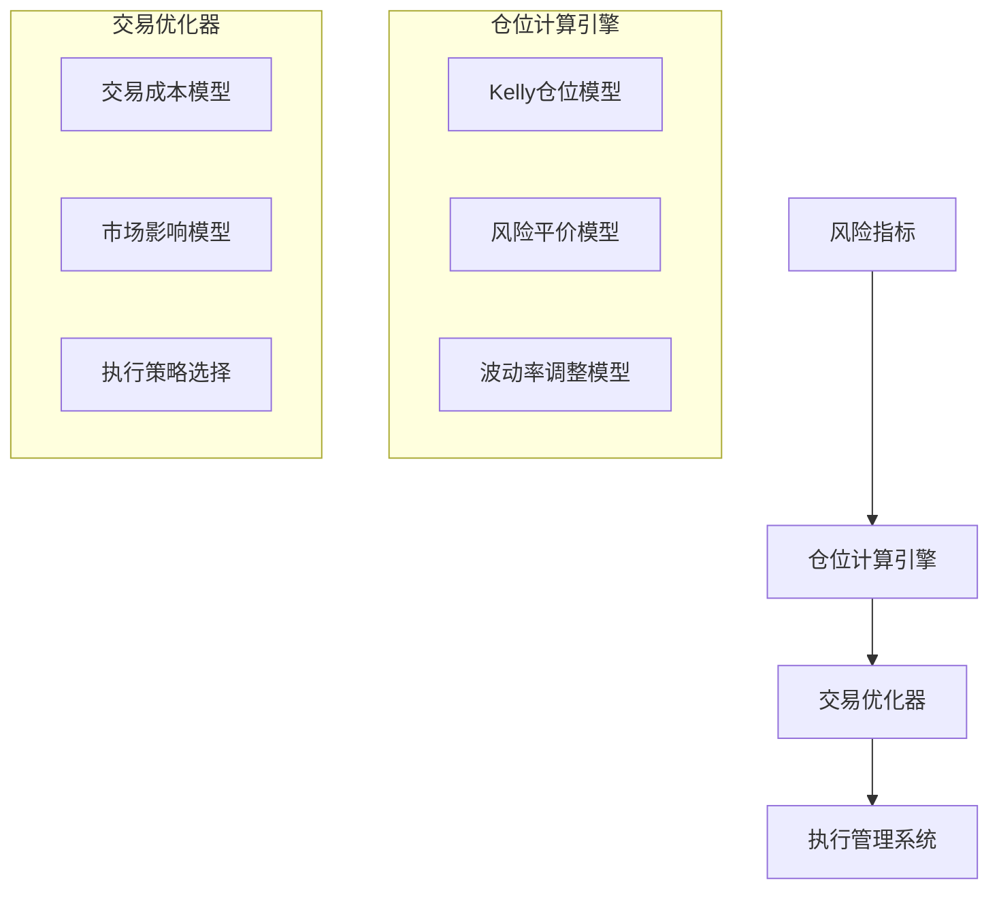

# 动态仓位调整系统设计

## 1. 核心功能
- 基于风险指标的动态仓位计算
- 多策略仓位分配
- 交易成本优化
- 再平衡策略管理

## 2. 架构设计

```mermaid
graph TD
    A[风险指标] --> B[仓位计算引擎]
    B --> C[交易优化器]
    C --> D[执行管理系统]
    
    subgraph 仓位计算引擎
        B1[Kelly仓位模型]
        B2[风险平价模型]
        B3[波动率调整模型]
    end
    
    subgraph 交易优化器
        C1[交易成本模型]
        C2[市场影响模型]
        C3[执行策略选择]
    end
```

## 3. 详细设计...