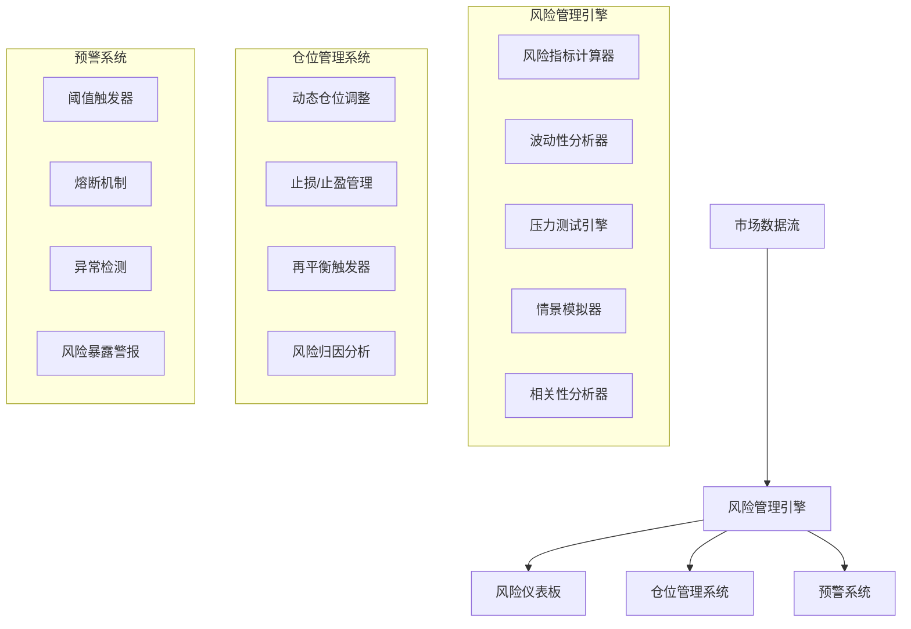
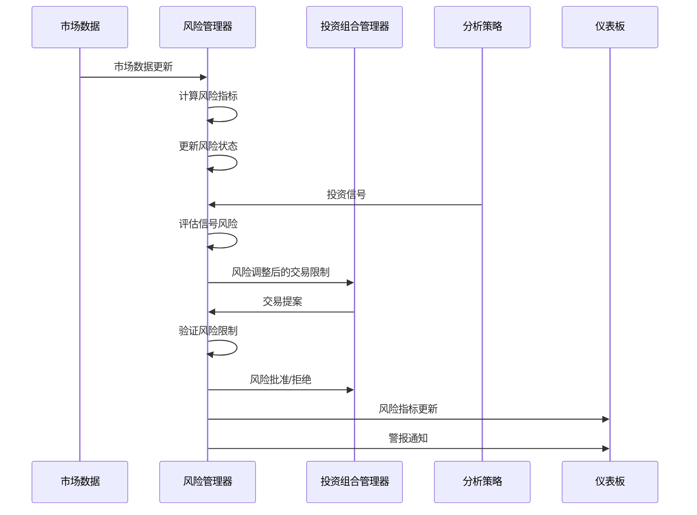

# 改进的风险管理系统架构设计

## 1. 概述

当前的风险管理系统非常基础，仅实现了简单的仓位限制（单一仓位不超过投资组合的20%），缺乏更复杂的风险评估和动态调整能力。本文档提出了一个全面的风险管理系统架构设计，包括实时监控和动态仓位调整功能。

## 2. 高级架构概览



## 3. 核心组件详细设计

### 3.1 风险管理引擎

#### 3.1.1 风险指标计算器

负责计算各种风险指标，包括但不限于：

- 风险价值(VaR)：使用历史模拟法、参数法和蒙特卡洛模拟法
- 条件风险价值(CVaR/Expected Shortfall)
- 最大回撤及当前回撤状态
- 夏普比率、索提诺比率
- 贝塔值
- 波动率（历史和隐含）

```python
class RiskMetricsCalculator:
    """计算各种风险指标的组件"""
    
    def calculate_var(self, portfolio, confidence_level=0.95, time_horizon=1, method="historical"):
        """计算投资组合的风险价值(VaR)
        
        参数:
            portfolio: 当前投资组合
            confidence_level: 置信水平(默认95%)
            time_horizon: 时间范围(默认1天)
            method: 计算方法("historical", "parametric", "monte_carlo")
        
        返回:
            float: VaR值
        """
        pass
    
    def calculate_cvar(self, portfolio, confidence_level=0.95, time_horizon=1):
        """计算条件风险价值(CVaR/Expected Shortfall)"""
        pass
    
    def calculate_drawdown(self, portfolio, window=None):
        """计算最大回撤及当前回撤状态"""
        pass
```

#### 3.1.2 波动性分析器

专注于分析和预测市场波动性：

- 识别当前波动性环境
- 检测波动性突破或异常
- 预测未来波动性（GARCH模型等）
- 计算隐含波动率

```python
class VolatilityAnalyzer:
    """分析市场和投资组合波动性的组件"""
    
    def analyze_regime_volatility(self, market_data):
        """识别当前市场波动性环境"""
        pass
    
    def detect_volatility_breakouts(self, market_data):
        """检测波动性突破或异常"""
        pass
    
    def forecast_volatility(self, market_data, method="garch"):
        """预测未来波动性"""
        pass
```

#### 3.1.3 压力测试引擎

执行各种压力测试和情景分析：

- 历史事件压力测试：基于历史市场崩盘或危机事件
- 假设情景压力测试：基于自定义假设场景
- 反向压力测试：找出导致特定损失水平的场景
- 敏感性分析：测试对各种市场因子的敏感度

```python
class StressTestEngine:
    """对投资组合进行压力测试的组件"""
    
    def historical_stress_test(self, portfolio, historical_events):
        """基于历史事件的压力测试"""
        pass
    
    def hypothetical_stress_test(self, portfolio, scenarios):
        """基于假设场景的压力测试"""
        pass
    
    def reverse_stress_test(self, portfolio, target_loss):
        """反向压力测试 - 找出导致特定损失的场景"""
        pass
```

#### 3.1.4 相关性分析器

分析资产间的相关性结构：

- 构建动态相关性矩阵
- 检测相关性结构变化
- 分析尾部相关性
- 识别潜在的风险集中

### 3.2 仓位管理系统

#### 3.2.1 动态仓位调整

根据风险指标动态调整最优仓位规模：

- 基于Kelly准则或风险平价方法计算理想仓位
- 根据波动性调整仓位规模
- 考虑资产相关性避免风险集中
- 生成分阶段仓位调整计划

```python
class PositionSizeManager:
    """管理仓位规模的组件"""
    
    def calculate_position_size(self, ticker, signal_strength, risk_metrics):
        """基于信号强度和风险指标计算理想仓位规模"""
        pass
    
    def adjust_for_volatility(self, position_size, ticker, volatility_metrics):
        """基于波动性调整仓位规模"""
        pass
    
    def adjust_for_correlation(self, portfolio, new_position, correlation_matrix):
        """考虑相关性的仓位调整"""
        pass
```

#### 3.2.2 止损/止盈管理

管理各种止损和止盈策略：

- 固定百分比止损
- 基于ATR的波动性止损
- 时间止损
- 追踪止损
- 动态止盈水平

```python
class StopLossManager:
    """管理止损和止盈的组件"""
    
    def set_stop_loss(self, position, method="fixed", **params):
        """设置止损位置
        
        方法可以是:
            - "fixed": 固定百分比止损
            - "atr": 基于平均真实范围的止损
            - "volatility": 基于波动性的动态止损
            - "time": 基于时间的止损
        """
        pass
    
    def set_take_profit(self, position, method="fixed", **params):
        """设置止盈位置"""
        pass
    
    def update_trailing_stops(self, positions, market_data):
        """更新追踪止损"""
        pass
```

#### 3.2.3 再平衡触发器

管理投资组合再平衡：

- 定时再平衡
- 阈值触发再平衡
- 风险触发再平衡
- 自适应再平衡频率

### 3.3 预警系统

#### 3.3.1 阈值触发器

监控关键指标并在超过预设阈值时触发警报：

- 设置多级别阈值
- 定制化警报消息
- 警报优先级管理

```python
class AlertSystem:
    """负责生成风险预警和熔断的组件"""
    
    def define_alert_thresholds(self, metrics, thresholds):
        """定义各种指标的警报阈值"""
        pass
    
    def check_alerts(self, current_metrics):
        """检查当前指标是否触发任何警报"""
        pass
    
    def activate_circuit_breaker(self, severity_level):
        """触发特定级别的熔断机制"""
        pass
```

#### 3.3.2 熔断机制

在极端市场条件下自动限制交易活动：

- 多级别熔断（警告、减少交易、完全停止）
- 基于实时风险指标的触发条件
- 恢复交易的条件策略

#### 3.3.3 异常检测

使用机器学习检测市场和投资组合中的异常模式：

- 价格异常检测
- 交易量异常检测
- 相关性结构变化检测
- 市场状态/环境变化检测

```python
class AnomalyDetector:
    """检测市场和投资组合中的异常模式"""
    
    def detect_price_anomalies(self, market_data, method="zscore"):
        """检测价格异常"""
        pass
    
    def detect_volume_anomalies(self, market_data):
        """检测交易量异常"""
        pass
    
    def detect_correlation_breakdown(self, correlation_matrix, historical_correlation):
        """检测相关性结构的变化"""
        pass
```

### 3.4 风险仪表板

实时可视化风险指标和警报的界面：

- 投资组合级别风险概览
- 各个仓位的风险贡献
- 活跃警报显示
- 自定义报告生成

```python
class RiskDashboard:
    """提供实时风险概览的仪表板"""
    
    def __init__(self, update_frequency=60):  # 每60秒更新一次
        self.update_frequency = update_frequency
        self.risk_metrics = {}
        self.alerts = []
        self.position_recommendations = {}
    
    def update_metrics(self, new_metrics):
        """更新显示的风险指标"""
        pass
    
    def display_portfolio_risk(self):
        """显示当前投资组合风险的摘要"""
        pass
```

## 4. 集成架构

### 4.1 主风险管理服务

集成所有风险管理功能的中央服务：

```python
class RiskManagementService:
    """集成所有风险管理功能的主服务"""
    
    def __init__(self):
        self.metrics_calculator = RiskMetricsCalculator()
        self.volatility_analyzer = VolatilityAnalyzer()
        self.stress_test_engine = StressTestEngine()
        self.position_manager = PositionSizeManager()
        self.stop_loss_manager = StopLossManager()
        self.alert_system = AlertSystem()
        self.anomaly_detector = AnomalyDetector()
        self.dashboard = RiskDashboard()
        self.risk_state = {}
    
    def process_market_update(self, market_data):
        """处理新的市场数据更新"""
        # 1. 更新风险指标
        # 2. 分析波动性变化
        # 3. 检测异常
        # 4. 更新仓位建议
        # 5. 检查止损条件
        # 6. 生成警报
        # 7. 更新仪表板
        pass
    
    def evaluate_new_signal(self, ticker, signal):
        """评估新的交易信号，考虑风险因素"""
        pass
    
    def run_daily_risk_assessment(self):
        """执行每日综合风险评估"""
        pass
```

### 4.2 与现有系统集成

#### 4.2.1 需要修改的关键文件

1. `src/agents/risk_manager.py`
   - 重构为使用新的风险管理服务
   - 维护向后兼容的API接口
   - 增加新的风险分析功能

2. `src/agents/portfolio_manager.py`
   - 扩展以处理更详细的风险限制和建议
   - 集成止损/止盈逻辑
   - 实现动态仓位调整

3. `src/graph/state.py`
   - 增强状态对象以包含更详细的风险信息
   - 添加风险相关的流程控制

4. 新文件: `src/risk/`
   - `metrics.py` - 风险指标计算
   - `volatility.py` - 波动性分析
   - `stress_test.py` - 压力测试功能
   - `position.py` - 仓位管理
   - `alerts.py` - 预警系统
   - `dashboard.py` - 风险仪表板

## 5. 数据流设计



## 6. 实施路线图

### 6.1 第1阶段：基础风险指标和监控

**预计完成时间**：2个月

1. 实现基本风险指标计算
   - VaR (历史模拟法)
   - 波动性计算
   - 最大回撤跟踪
   - 基本相关性分析

2. 建立简单的风险监控仪表板
   - 投资组合风险概览
   - 单一资产风险指标
   - 基本警报显示

3. 实现简单的止损策略
   - 固定百分比止损
   - 追踪止损

4. 为仓位限制添加波动性调整
   - 基于历史波动性的仓位规模调整
   - 简单的相关性考虑

### 6.2 第2阶段：高级风险控制与动态调整

**预计完成时间**：3个月

1. 实现压力测试引擎
   - 历史场景分析
   - 自定义假设情景
   - 敏感性分析

2. 添加动态仓位调整
   - Kelly准则实现
   - 风险平价方法
   - 多因子仓位调整

3. 实现复杂的止损/止盈策略
   - ATR止损
   - 波动性调整止损
   - 多级别止盈

4. 建立预警系统和熔断机制
   - 多级别阈值触发
   - 基于波动性的熔断
   - 异常检测警报

### 6.3 第3阶段：集成与优化

**预计完成时间**：3个月

1. 与多策略系统整合
   - 风险调整的策略权重
   - 跨策略风险管理
   - 策略相关性分析

2. 实现风险归因分析
   - 因子风险分解
   - 策略风险贡献
   - 历史风险分析

3. 添加异常检测能力
   - 价格异常检测
   - 波动性异常检测
   - 流动性异常检测

4. 优化性能和可扩展性
   - 并行风险计算
   - 增量更新优化
   - 分布式风险计算

## 7. 技术考虑

### 7.1 性能优化

1. 高效数据处理
   - 使用NumPy和Pandas的向量化操作
   - 缓存中间计算结果
   - 增量更新风险指标

2. 并行处理
   - 使用多线程计算不同资产的风险指标
   - 后台运行压力测试
   - 异步更新仪表板

3. 数据存储与访问
   - 优化风险数据的存储结构
   - 实现高效的数据访问模式
   - 考虑使用专用的时间序列数据库

### 7.2 扩展性考虑

1. 模块化设计
   - 明确定义组件间接口
   - 允许替换或扩展各个组件
   - 支持插件式风险指标

2. 配置驱动
   - 通过配置调整风险参数
   - 动态加载风险模型
   - 自定义风险规则

3. 未来扩展方向
   - 机器学习风险预测
   - 高频数据风险分析
   - 外部风险因子集成

## 8. 关键风险指标

### 8.1 投资组合级别指标

- VaR (95%, 99%)
- CVaR/Expected Shortfall
- 波动率（历史和隐含）
- 最大回撤
- 夏普比率
- 索提诺比率
- Omega比率
- 相关性矩阵热图
- 风险调整后收益

### 8.2 位置级别指标

- 风险贡献（占总VaR的百分比）
- 贝塔系数
- 资产特定波动性
- 止损距离百分比
- 仓位规模相对于理想值
- 历史胜率
- 预期风险回报比

## 9. 总结

本架构设计提供了一个全面的风险管理系统框架，旨在升级当前的基础风险管理功能，使其具备实时监控和动态仓位调整能力。通过分阶段实施，该系统将逐步增强AI对冲基金的风险管理能力，提高投资决策的稳健性和一致性。

系统的模块化设计确保了可扩展性，使未来能够轻松集成新的风险指标和控制机制。同时，性能优化考虑确保了系统能够高效处理大量市场数据和复杂计算。