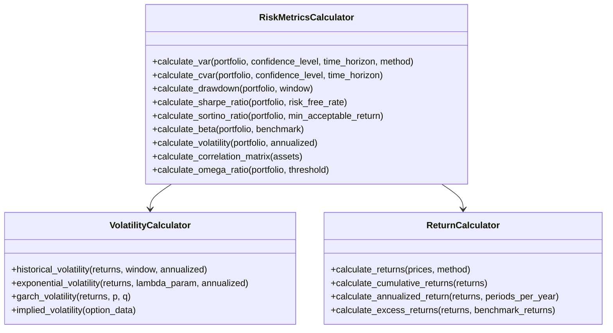

# 风险指标计算器详细设计

这个文档详细描述了风险指标计算器的设计，作为风险管理系统架构的核心组件。

## 1. 概述

风险指标计算器负责计算各种金融风险指标，为交易决策和风险管理提供量化支持。这个组件将支持多种风险度量方法，从基础的波动率计算到高级的VaR和压力测试。

## 2. 类设计



## 3. 核心风险指标

### 3.1 风险价值(VaR)

Value at Risk (VaR) 是一个表示在给定概率水平下，在指定时间内的最大潜在损失。我们将实现三种不同的VaR计算方法：

#### 3.1.1 历史模拟法

```
算法:
1. 获取资产或投资组合的历史价格数据
2. 计算日收益率
3. 按收益率从小到大排序
4. 根据置信水平(例如95%)找到相应的百分位数
5. 将该百分位数乘以当前投资组合价值
```

历史模拟法的优点是不假设任何特定的概率分布，直接使用历史数据；缺点是严重依赖历史数据的代表性。

#### 3.1.2 参数法(方差-协方差法)

```
算法:
1. 计算资产或投资组合的平均收益率(μ)和标准差(σ)
2. 根据指定的置信水平找到正态分布的相应Z值
3. VaR = 投资组合价值 * (μ - Z * σ) * sqrt(时间段)
```

参数法假设收益率服从正态分布，计算快速但可能低估尾部风险。

#### 3.1.3 蒙特卡洛模拟法

```
算法:
1. 估计资产收益率的概率分布参数
2. 生成大量(如10,000次)随机模拟
3. 计算每次模拟的投资组合价值变化
4. 根据置信水平找到模拟结果的相应百分位数
```

蒙特卡洛法允许模拟复杂情景，但计算密集且需要正确指定概率分布。

### 3.2 条件风险价值(CVaR)

也称为预期尾部损失(Expected Shortfall)，表示超过VaR阈值后的平均损失。

```
算法:
1. 计算指定置信水平的VaR
2. 找出所有超过VaR阈值的损失情景
3. 计算这些超额损失的平均值
```

CVaR提供了VaR之外的额外信息，特别是关于极端损失的严重程度。

### 3.3 回撤分析

#### 3.3.1 最大回撤

```
算法:
1. 跟踪投资组合价值的峰值
2. 计算当前价值与峰值之间的差距百分比
3. 记录历史上最大的回撤值
```

#### 3.3.2 回撤持续时间

```
算法:
1. 记录新高点的时间
2. 当出现回撤时，跟踪持续时间
3. 维护历史上最长回撤周期记录
```

#### 3.3.3 回撤频率

```
算法:
1. 设定回撤阈值(例如5%, 10%, 20%)
2. 计算特定时间段内超过各阈值的回撤次数
```

### 3.4 风险调整收益比率

#### 3.4.1 夏普比率(Sharpe Ratio)

```
算法:
Sharpe Ratio = (平均收益率 - 无风险利率) / 收益率标准差
```

#### 3.4.2 索提诺比率(Sortino Ratio)

```
算法:
Sortino Ratio = (平均收益率 - 最低可接受收益率) / 下行标准差
```

其中下行标准差只考虑低于最低可接受收益率的收益。

#### 3.4.3 Omega比率

```
算法:
1. 选择阈值收益率(通常为0或无风险利率)
2. 计算高于阈值的收益与低于阈值的损失之比
```

### 3.5 相关性和分散化指标

#### 3.5.1 相关性矩阵

```
算法:
1. 计算所有资产对之间的相关系数
2. 构建相关性矩阵
3. 可视化热图显示
```

#### 3.5.2 有效分散化指数(EDI)

```
算法:
EDI = 1 / (投资组合方差 / 权重平方加权的个别资产方差和)
```

值接近1表示高度分散，接近1/N(N是资产数量)表示高度集中。

## 4. 实现考虑

### 4.1 性能优化

1. **向量化计算**：使用NumPy和Pandas提供的向量化操作，避免Python循环
   
2. **缓存中间结果**：
   ```python
   @lru_cache(maxsize=128)
   def calculate_volatility(self, ticker, window=252):
       # 计算代码...
       return volatility
   ```

3. **惰性计算**：仅在需要时计算和更新风险指标
   
4. **并行处理**：对于计算密集型任务如蒙特卡洛模拟，使用多线程处理

### 4.2 数据需求

1. **历史价格数据**：至少2-3年的日收盘价
2. **交易量数据**：评估流动性风险
3. **基准数据**：用于相对表现和贝塔计算
4. **经济指标**：可选，用于宏观压力测试
5. **波动率曲面数据**：可选，用于隐含波动率计算

### 4.3 异常处理

1. **数据缺失策略**：
   - 使用前向/后向填充
   - 线性或样条插值
   - 在极端情况下丢弃不完整记录

2. **异常值检测**：
   - Z-score方法
   - IQR (四分位距)方法
   - DBSCAN聚类

3. **错误边界**：
   - 设置风险指标的合理范围
   - 警告或拒绝计算结果超出合理范围的情况

## 5. 扩展性设计

### 5.1 插件架构

设计为可扩展的插件架构，允许轻松添加新的风险指标计算方法：

```python
# 示例概念性设计
class RiskMetricPlugin:
    """所有风险指标插件的基类"""
    def calculate(self, data, **params):
        raise NotImplementedError
        
class VarHistoricalPlugin(RiskMetricPlugin):
    """历史模拟法VaR插件"""
    def calculate(self, data, confidence_level=0.95, **params):
        # 实现历史模拟法VaR
        pass
```

### 5.2 配置驱动

创建配置驱动的风险计算，允许通过配置文件调整参数而不需修改代码：

```
# risk_config.yaml 示例
var:
  default_method: historical
  confidence_levels: [0.95, 0.99]
  time_horizons: [1, 5, 10]
  
volatility:
  default_window: 252
  annualized: true
```

## 6. 测试策略

### 6.1 单元测试

为每个风险指标创建专门的单元测试，使用已知结果验证计算：

1. **已知场景测试**：使用手动计算的简单情景验证基本功能
2. **边界条件测试**：测试极端参数和市场条件
3. **性能测试**：确保大型投资组合的计算效率

### 6.2 集成测试

测试风险指标计算器与其他系统组件的集成：

1. **数据流测试**：验证从数据源到风险计算的数据流
2. **配置测试**：验证不同配置设置下的行为
3. **端到端场景**：模拟真实的风险管理场景

## 7. 接口设计

### 7.1 公共API

```python
# 概念性API设计
def calculate_var(portfolio, confidence_level=0.95, time_horizon=1, method="historical"):
    """计算投资组合的风险价值(VaR)
    
    参数:
        portfolio: 包含资产及权重的投资组合对象
        confidence_level: 置信水平(默认95%)
        time_horizon: 时间范围(默认1天)
        method: 计算方法("historical", "parametric", "monte_carlo")
    
    返回:
        float: VaR值
        dict: 附加信息(如计算细节、组件贡献等)
    """
    
def calculate_risk_report(portfolio, config=None):
    """生成完整的风险报告
    
    参数:
        portfolio: 投资组合对象
        config: 可选的配置对象，指定要计算的风险指标
        
    返回:
        RiskReport: 包含所有计算风险指标的报告对象
    """
```

### 7.2 数据结构

```python
# 投资组合表示
Portfolio = {
    "positions": {
        "AAPL": {"weight": 0.20, "shares": 100, "price": 150.0},
        "MSFT": {"weight": 0.15, "shares": 50, "price": 300.0},
        # 其他资产...
    },
    "cash": 10000.0,
    "total_value": 100000.0
}

# 风险报告结构
RiskReport = {
    "timestamp": "2025-03-25T12:00:00",
    "portfolio_value": 100000.0,
    "risk_metrics": {
        "var": {
            "95_1day_historical": 2500.0,
            "99_1day_historical": 4200.0,
            "95_1day_parametric": 2300.0,
            # 其他VaR变体...
        },
        "cvar": {
            "95_1day": 3200.0,
            # 其他CVaR变体...
        },
        "volatility": {
            "annualized": 0.18,
            "daily": 0.011
        },
        # 其他风险指标...
    },
    "asset_contributions": {
        "AAPL": {
            "var_contribution": 0.35,  # 占总VaR的35%
            "volatility_contribution": 0.40
        },
        # 其他资产贡献...
    }
}
```

## 8. 未来增强

1. **机器学习风险预测**：使用ML模型预测市场波动性和风险爆发
2. **尾部风险建模**：更复杂的极端事件分析
3. **流动性风险指标**：衡量投资组合的流动性风险
4. **情绪和新闻风险分析**：整合市场情绪和新闻事件对风险的影响
5. **前瞻性情景分析**：基于预期市场事件的情景分析

## 9. 风险指标评估标准

创建以下准则评估风险指标计算的质量：

1. **准确性**：与业界标准比较
2. **稳定性**：对输入数据的小变化不应产生大的波动
3. **计算效率**：性能测试标准
4. **可解释性**：指标应具有明确的金融解释
5. **可行性**：指标应导致可操作的投资决策

## 10. 总结

风险指标计算器是整个风险管理系统的基础，提供量化的风险评估工具。通过分层设计和模块化架构，我们可以构建一个灵活、高效且可扩展的系统，支持从基础的波动率计算到高级的风险分析工具。这个组件将直接支持更高级的风险管理功能，如动态仓位调整和预警系统。