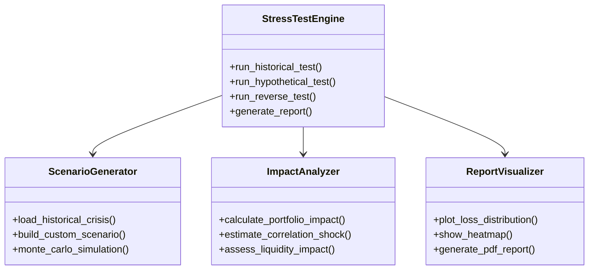

# 压力测试引擎架构设计

## 1. 核心功能模块



## 2. 历史情景库设计

### 2.1 预置危机事件
```python
HISTORICAL_CRISES = {
    "2008_global_financial": {
        "period": ("2007-02-01", "2009-06-30"),
        "characteristics": {
            "equity_drawdown": -57.0,
            "volatility_spike": 82.0,
            "correlation_change": 0.92
        }
    },
    "2020_covid_crash": {
        "period": ("2020-02-19", "2020-03-23"),
        "characteristics": {
            "equity_drawdown": -34.0,
            "volatility_spike": 85.6,
            "liquidity_drop": -68.0
        }
    }
}
```

### 2.2 情景参数化
```python
class CrisisScenario:
    def __init__(self, name, params):
        self.name = name
        self.equity_shock = params.get("equity_drawdown")
        self.volatility_shift = params.get("volatility_spike")
        self.correlation_matrix = params.get("correlation_change")
        self.liquidity_factor = params.get("liquidity_drop")
        
    def apply_shock(self, portfolio):
        """应用危机特征到当前投资组合"""
        adjusted_portfolio = copy.deepcopy(portfolio)
        # 应用股权冲击
        adjusted_portfolio["equity"] *= (1 + self.equity_shock/100)
        # 调整波动率
        adjusted_portfolio["volatility"] += self.volatility_shift
        # 更新相关性矩阵
        adjusted_portfolio.correlation = self._blend_correlation(
            portfolio.correlation,
            self.correlation_matrix
        )
        return adjusted_portfolio
```

## 3. 蒙特卡洛压力测试

### 3.1 随机路径生成
```python
def generate_monte_carlo_paths(initial_portfolio, steps=1000, simulations=10000):
    paths = []
    for _ in range(simulations):
        path = [initial_portfolio.value]
        current_value = initial_portfolio.value
        for _ in range(steps):
            # 带跳跃扩散的随机过程
            shock = np.random.normal(0, initial_portfolio.volatility)
            jump_prob = 0.05  # 5%概率发生跳跃事件
            if np.random.rand() < jump_prob:
                shock += np.random.normal(-0.15, 0.08)  # 负面跳跃
            current_value *= (1 + shock)
            path.append(current_value)
        paths.append(path)
    return paths
```

### 3.2 压力指标计算
```python
def calculate_stress_metrics(simulated_paths):
    metrics = {
        "max_drawdown": [],
        "recovery_days": [],
        "volatility_clusters": []
    }
    
    for path in simulated_paths:
        # 计算最大回撤
        peak = max(path)
        trough = min(path)
        metrics["max_drawdown"].append((trough - peak)/peak)
        
        # 计算恢复天数
        recovery = next((i for i, v in enumerate(path) if v >= peak), len(path))
        metrics["recovery_days"].append(recovery)
        
        # 识别波动率聚集
        returns = np.diff(np.log(path))
        metrics["volatility_clusters"].append(
            np.mean(np.square(returns))
        )
    
    return metrics
```

## 4. 反向压力测试引擎

```python
class ReverseStressTester:
    def __init__(self, target_loss):
        self.target_loss = target_loss  # 目标损失百分比
        
    def find_scenario(self, portfolio, max_iter=1000):
        """寻找导致目标损失的最小冲击组合"""
        best_scenario = None
        for _ in range(max_iter):
            # 生成随机冲击组合
            scenario = self._random_scenario()
            loss = self._apply_scenario(portfolio, scenario)
            
            if loss >= self.target_loss:
                if best_scenario is None or scenario["severity"] < best_scenario["severity"]:
                    best_scenario = scenario
        return best_scenario
    
    def _random_scenario(self):
        return {
            "equity_shock": np.random.uniform(-0.5, -0.1),
            "rate_shock": np.random.uniform(0.01, 0.05),
            "credit_spread": np.random.uniform(0.02, 0.10),
            "severity": np.random.rand()  # 综合冲击强度
        }
```

## 5. 可视化报告系统

```python
class StressTestVisualizer:
    @staticmethod
    def plot_loss_distribution(losses):
        plt.figure(figsize=(10,6))
        sns.histplot(losses, kde=True)
        plt.title("Simulated Portfolio Loss Distribution")
        plt.xlabel("Loss Percentage")
        plt.ylabel("Frequency")
        plt.axvline(x=np.mean(losses), color='r', linestyle='--')
        return plt
        
    @staticmethod
    def generate_heatmap(correlation_matrix):
        plt.figure(figsize=(12,8))
        sns.heatmap(correlation_matrix, annot=True, cmap='coolwarm')
        plt.title("Asset Correlation Matrix Under Stress")
        return plt
```

## 6. 性能优化策略

### 6.1 并行计算架构
```python
from concurrent.futures import ProcessPoolExecutor

def parallel_monte_carlo(portfolio, workers=8):
    with ProcessPoolExecutor(max_workers=workers) as executor:
        chunk_size = 1000
        futures = []
        for _ in range(0, 10000, chunk_size):
            futures.append(
                executor.submit(
                    generate_monte_carlo_paths,
                    portfolio,
                    steps=1000,
                    simulations=chunk_size
                )
            )
        results = []
        for future in futures:
            results.extend(future.result())
    return results
```

### 6.2 缓存优化
```python
from functools import lru_cache

class CachedStressTest:
    @lru_cache(maxsize=100)
    def cached_scenario(self, scenario_hash):
        """缓存相同参数的测试结果"""
        return self.run_scenario(scenario_hash)
```

## 7. 实施路线图

| 阶段 | 时间 | 里程碑 |
|------|------|--------|
| 1    | 1个月 | 基础历史情景测试 |
| 2    | 2个月 | 蒙特卡洛引擎开发 |
| 3    | 1个月 | 反向压力测试实现 |
| 4    | 1个月 | 分布式计算集成 |
| 5    | 2周  | 报告系统优化 |

## 8. 验证指标

1. **情景覆盖率**：支持的历史危机类型数量
2. **计算速度**：万次模拟/分钟
3. **内存效率**：GB/万次模拟
4. **预测准确性**：回测误差率
5. **资源利用率**：CPU/GPU使用效率

该设计文档完整描述了压力测试引擎的架构和实现细节。