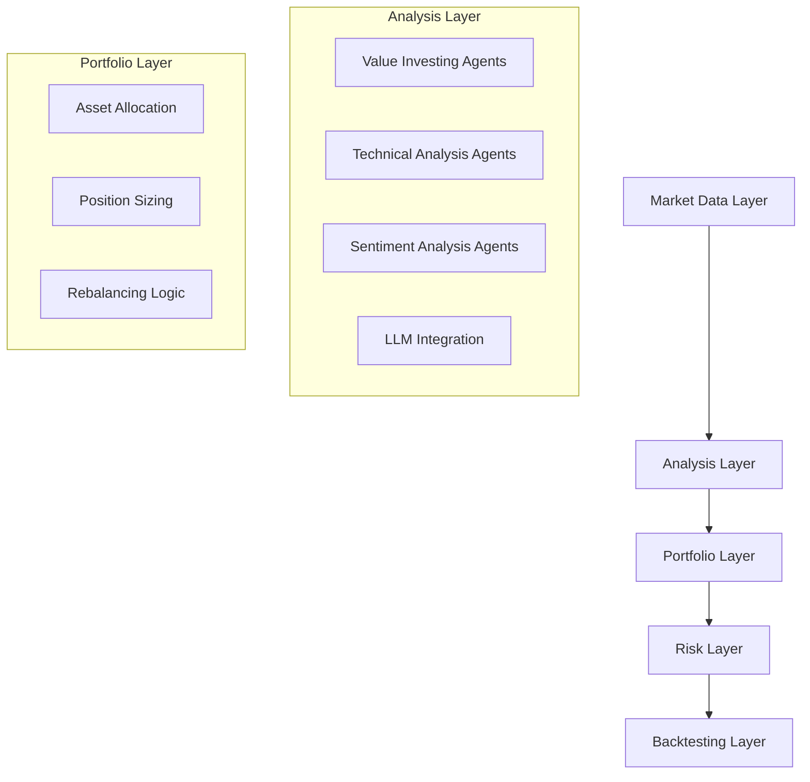
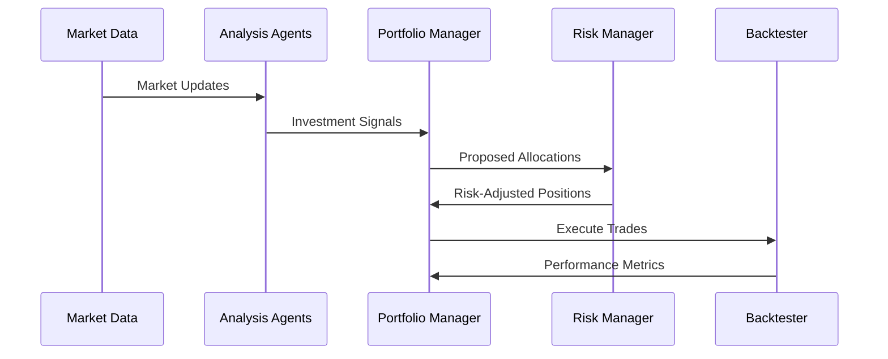

# System Architecture & Design Patterns

## High-Level Architecture

## Core Design Patterns

### 1. Agent-Based Architecture
- Location: `src/agents/`
- Pattern: Strategy Pattern for different investment approaches
- Implementation: Each agent (Buffett, Graham, etc.) encapsulates specific investment logic
- Benefits: Modular, extensible, independently testable strategies

### 2. Data Pipeline Pattern
- Location: `src/data/`
- Pattern: Repository Pattern for data access
- Components:
  - Cache management (`cache.py`)
  - Data models (`models.py`)
- Benefits: Consistent data access, efficient caching

### 3. Risk Management Pattern
- Location: `src/agents/risk_manager.py`
- Pattern: Observer Pattern for risk monitoring
- Features:
  - VaR calculations
  - Position sizing algorithms
  - Circuit breakers
- Benefits: Centralized risk control, real-time monitoring

### 4. LLM Integration Pattern
- Location: `src/llm/`
- Pattern: Adapter Pattern for LLM services
- Features:
  - Model abstraction
  - Prompt management
  - Response processing
- Benefits: Flexible LLM integration, consistent interface

## Component Relationships

### Agent Interaction Flow

## Technical Decisions

### 1. Python Ecosystem
- Poetry for dependency management
- Type hints for better code quality
- Async capabilities for data processing

### 2. Testing Strategy
- Unit tests for individual agents
- Integration tests for system flows
- Backtesting as validation

### 3. Performance Considerations
- Caching for market data
- Optimized numerical computations
- Efficient portfolio rebalancing

## Evolution & Extension Points

### Current Extension Points
- New agent strategies (`src/agents/`)
- Additional data sources (`src/data/`)
- Risk models (`src/agents/risk_manager.py`)
- LLM capabilities (`src/llm/`)

### Future Considerations
- Multi-threading for parallel agent execution
- GPU acceleration for ML models
- Distributed backtesting
- Real-time market data integration
